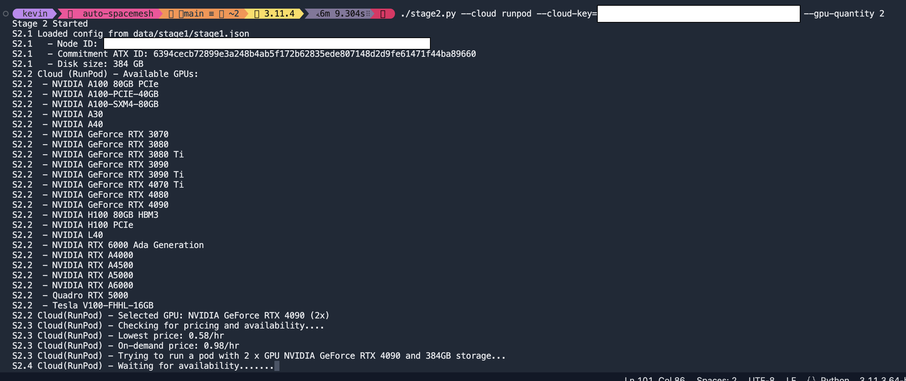

# auto-spacemesh

Contribute SMH to `sm1qqqqqqxre24mtprsmuht8gfhu28z95hm22zvrdq34rmr8`, much appreciated!

## Stages

|Stage #|Script|Purpose|
|-------|------|-------|
|1|`stage1.sh`|Generate new key.bin and Node ID, get latest Commitment ATX ID and prepare node for potential further use|
|2|`stage2.py`|Generate PoST locally, remotely via SSH, or in the Cloud|
|3|`stage3.py`|Verification of PoST data|
|4|`stage4.py`|Run/manage node|
